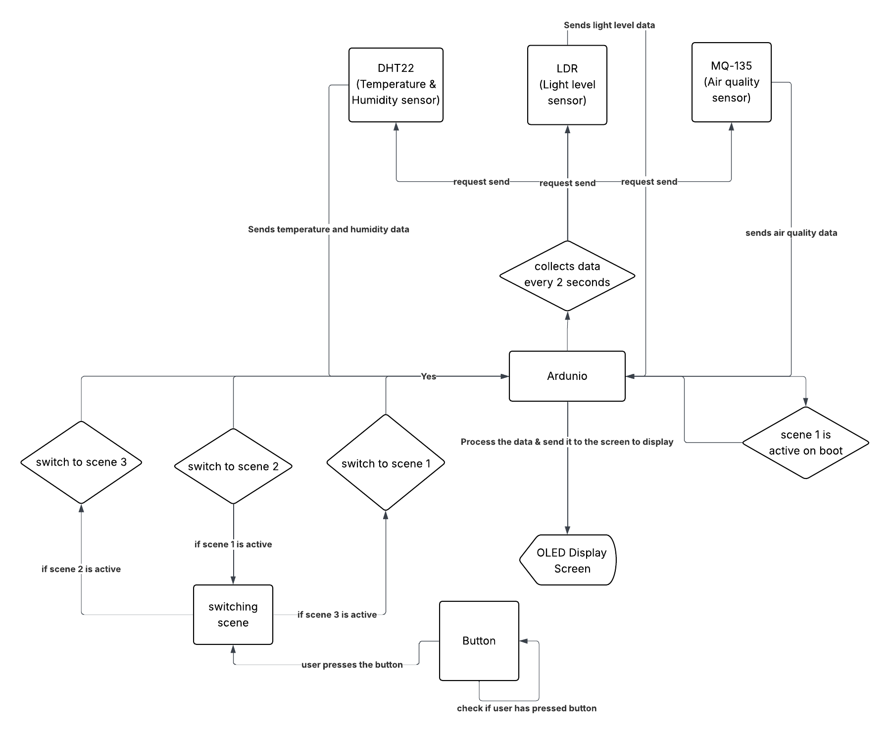
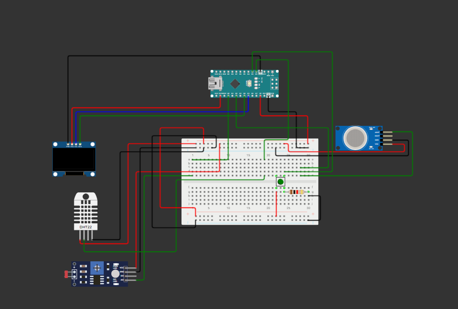

# DIY Indoor Environment Monitoring System

A fun and easy **DIY gadget** project to monitor your indoor environment using an **Arduino Nano**. Measure **temperature, humidity, light level, and air quality** in real-time and display it on a **2.5-inch OLED screen**. Perfect for hobbyists, makers, and anyone who wants to understand their indoor environment better.

### Link to the ardunio simulation project - https://wokwi.com/projects/448439908062672897

## Features

- Monitor **Temperature (°C/°F)**, **Humidity (%)**, **Light Level**, and **Air Quality**.  
- Real-time display on a **2.5-inch OLED screen**.  
- The device includes a multi-scene interface. A single button is used to cycle through four different viewing modes.
    ### Scene 1 — Overview
    - Displays all sensor data at once:
    - Temperature (°C)
    - Humidity (%)
    - Light level
    - Air quality level

    ### Scene 2 — Temperature & Humidity Focus
    - Enlarged temperature display
    - Enlarged humidity display
    - Ideal for quick comfort monitoring

    ### Scene 3 — Light Sensor Detailed View
    - Light level value
    - Raw LDR resistance/analog reading (for debugging)

    ### Scene 4 — Air Quality Detailed View
    - Air quality level value
    - Raw air sensor analog reading (for detailed diagnostics)

    **Scene Cycle Order:**  
    Overview → Temp/Humidity → Light → Air Quality → (loops back)

---

## Hardware Components

- **Arduino Nano** – the brain of the project.  
- **DHT22 Sensor (Adafruit)** – measures temperature and humidity.  
- **LDR Sensor** – detects ambient light levels.  
- **MQ135 Sensor** – measures air quality (CO₂ and other gases).  
- **2.5-inch OLED Display** – visualizes sensor data.  
- Breadboard and jumper wires for prototyping.

---

## Software & Libraries

- Arduino IDE  
- [Adafruit DHT library](https://github.com/adafruit/DHT-sensor-library) – for DHT22 sensor.
- [Adafruit SSD1306 library](https://github.com/adafruit/Adafruit_SSD1306) - for display  
- [Adafruit GFX library](https://github.com/adafruit/Adafruit-GFX-Library) – for display graphics.
- OLED driver library (depends on your display, e.g., `Adafruit_SSD1351` or `Adafruit_SSD1306`).  

---

## System Design

The system follows a **simple sensor → Arduino → display** flow:

    1. **Sensors**: Collect data for temperature, humidity, light, and air quality.  
    2. **Arduino Nano**: Reads the sensor values every ~2 seconds and formats them for display.  
    3. **OLED Display**: Shows live readings in an easy-to-read format (numbers, bars, or simple graphs).  

### Block Diagram

### Circuit Diagram

